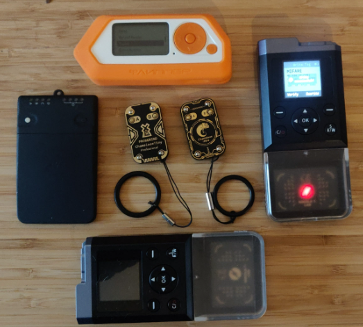
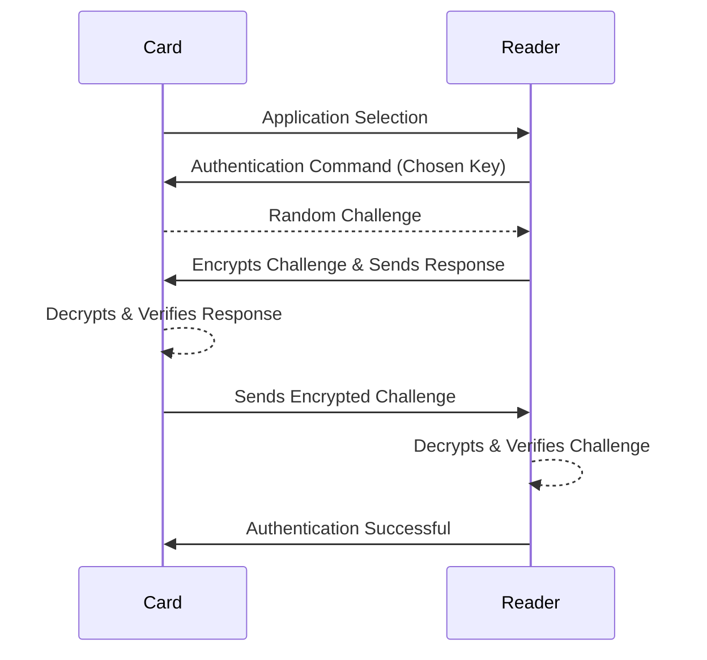
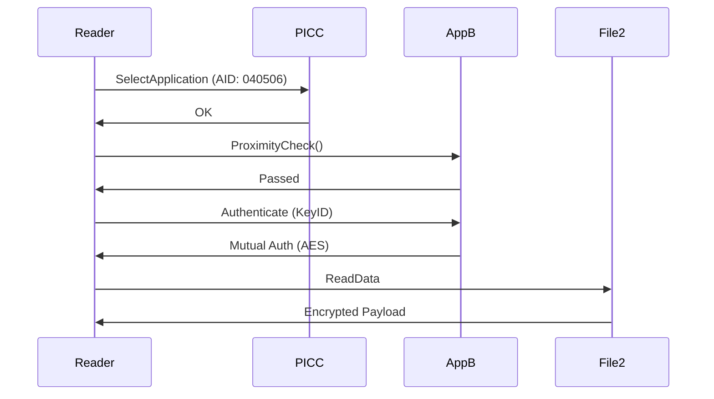
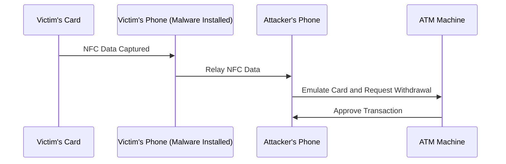

<div style="text-align: center; margin-top: 200px;">
  <h1>NFC and RFID Phyiscal Security Penetration Test</h1>
  <h3>Version 1.0</h3>
  <p><strong>Author:</strong> Mohamed Fouad</p>
  <p><strong>Date:</strong> March 26, 2025</p>
  
</div>

<div style="page-break-after: always;"></div>

[TOC]

<div style="page-break-after: always;"></div>

# Physical Security: NFC and RFID Technologies

## Document Properties
- **Title**: Physical Security: NFC and RFID Technologies  
- **Subtitle**: Attacks, Authentication Mechanisms, and Assessment Tools  
- **Presented by**: [Mohamed Fouad]

---

<div style="page-break-before: always;"></div>

## Introduction

- **Definition of Physical Security**
  - Protects assets, buildings, and data from physical threats.
- **Importance**
  - Prevents unauthorized access, theft, and damage.
- **Technology Integration**
  - Combines electronic and physical measures.

<div style="page-break-before: always;"></div>

## NFC vs. RFID

- **NFC (Near Field Communication)**
  - Short-range communication (up to 10 cm).
  - Frequency: 13.56 MHz.
  - Uses: Mobile payments, access control.
- **RFID (Radio Frequency Identification)**
  - Longer-range communication (up to several meters).
  - Frequencies: LF (125–134 kHz), HF (13.56 MHz), UHF (860–960 MHz).
  - Uses: Inventory management, asset tracking.
- **Key Differences**
  - Range and frequency.
  - Typical applications.

<div style="page-break-before: always;"></div>

---

## NFC Technologies Overview
- **NFC Card Types**
  - MIFARE Classic
  - MIFARE DESFire
  - MIFARE Ultralight
  - FeliCa
- **Applications**
  - Access control, payments, ticketing.
---

<div style="page-break-after: always;"></div>

## **MIFARE Classic Cards**

- **Technical Specifications**
  
  - Storage: 1KB or 4KB.
  - Sectors: 16 (1KB) or 40 (4KB).
- **Security Features**
  
  - Uses two keys per sector (Key A and Key B) for access control.
  - **Sector Trailer**: Contains Key A (6 bytes), Access Conditions (4 bytes), and Key B (6 bytes; optional).
  - **SAK (Select Acknowledge)**: Indicates the card type and its capabilities.
  - **ASAQ (Access Settings and Access Qualifications)**: Uses bits (C1, C2, C3) to set permissions for each data block.
  
  

### Sector Trailer in MIFARE Classic Cards

#### Definition

The **sector trailer** is a special data block within each sector of a **MIFARE Classic card** that **stores access control settings and cryptographic keys** used for authentication. It is crucial for defining how data in that sector can be accessed, modified, or protected.


------

### Sector Structure in MIFARE Classic Cards

A **MIFARE Classic** card consists of multiple **sectors**, and each **sector contains four blocks** (except for the last sector in 4KB cards, which has 16 blocks). The last block of each sector is known as the **Sector Trailer**.

- **1KB Cards:** 16 sectors, each containing 4 blocks.
- **4KB Cards:** 40 sectors (32 sectors with 4 blocks + 8 sectors with 16 blocks).
- **Sector Trailer:** Always the last block in each sector.

| **MIFARE Classic 1KB Card Structure** | **Sector #** | **Block #**        | **Block Type**                        |
| ------------------------------------- | ------------ | ------------------ | ------------------------------------- |
| **Sector 0**                          | 0            | Data Block         | Data Storage                          |
|                                       | 1            | Data Block         | Data Storage                          |
|                                       | 2            | Data Block         | Data Storage                          |
|                                       | 3            | **Sector Trailer** | Stores access control settings & keys |
| **Sector 1**                          | 4            | Data Block         | Data Storage                          |
|                                       | 5            | Data Block         | Data Storage                          |
|                                       | 6            | Data Block         | Data Storage                          |
|                                       | 7            | **Sector Trailer** | Stores access control settings & keys |

------

<div style="page-break-before: always;"></div>

### Structure of a Sector Trailer

Each **sector trailer** consists of **16 bytes** divided into three main sections:

| **Byte Range** | **Function**                   | **Description**                                        |
| -------------- | ------------------------------ | ------------------------------------------------------ |
| 0-5            | **Key A**                      | 6-byte cryptographic key for authentication            |
| 6-9            | **Access Control Bytes (ACB)** | 4 bytes defining read/write permissions for the sector |
| 10             | **User Byte (Optional)**       | Can be used for additional security configuration      |
| 11-15          | **Key B (Optional)**           | 6-byte cryptographic key (if used)                     |

------

### Detailed Breakdown of Sector Trailer Components

#### 1. Key A (First 6 Bytes)

- Used for **authentication** before accessing data.
- Required for **reading, writing, incrementing, and decrementing** data blocks within the sector.
- Not directly readable (cannot be extracted from a normal reader).

#### 2. Access Conditions (4 Bytes)

These **Access Control Bytes (ACB)** define the **read/write permissions** for:

- **Data Blocks (0, 1, 2)**
- **Sector Trailer (Block 3 in each sector)**

**Access Condition Structure:**

- **C1, C2, C3 Bits:** Control how each block can be accessed.
- If these bits are **incorrectly configured**, the sector may become **permanently locked**.

| **Access Bits (C1, C2, C3)** | **Data Blocks (0-2)** | **Sector Trailer (Block 3)**             |
| ---------------------------- | --------------------- | ---------------------------------------- |
| 000                          | Read/Write Allowed    | Change Key A/B, Modify Access Conditions |
| 100                          | Read Only             | Modify Access Conditions Allowed         |
| 110                          | No Read/Write         | Cannot Modify Access Conditions          |

#### 3. User Byte (1 Byte)

- Sometimes used for **additional security features** (e.g., manufacturer ID, sector-specific flags).
- Can store **manufacturer-defined settings**.

#### 4. Key B (Last 6 Bytes)

- **Optional** (sometimes left empty).

- When used, Key B provides an additional level of security:

  - **If configured properly**, Key B allows different authentication levels for different user groups.
- In some cases, Key B may be used only for **writing permissions** (while Key A is used for reading).

------

### Sector Trailer Example (Hexadecimal Representation)

```
A0 A1 A2 A3 A4 A5  FF 07 80 69  00 00 00 00 00 00
```

**Breakdown:**

- **A0 A1 A2 A3 A4 A5** → Key A (6 bytes)
- **FF 07 80 69** → Access Condition Bytes
- **00** → User Byte
- **00 00 00 00 00 00** → Key B (6 bytes)

------

<div style="page-break-before: always;"></div>

#### Role of the Sector Trailer in Security

- **Defines who can read/write data blocks** in a sector.

- **Controls modifications to the access conditions** and encryption keys.

- **Prevents unauthorized access** if properly configured.

- **Can be exploited if weak encryption is used** (e.g., MIFARE Classic’s **CRYPTO1 weakness**).

- **Authentication Process (Step-by-Step)**
  1. **Sector Selection**: Reader selects a specific sector.
  2. **Authentication Request**: Reader sends an authentication command for that sector, specifying Key A or Key B.
  3. **Card Challenge**: Card responds with a random nonce.
  4. **Reader Response**: Reader encrypts the nonce with the designated key and sends the result.
  5. **Card Verification**: Card decrypts the reader’s response and compares it with its calculation.
  6. **Mutual Authentication**: Card sends its own encrypted nonce back to the reader.
  7. **Final Verification**: Reader verifies the card’s response to complete the authentication.
  
  
  
  
  
  ```mermaid
  sequenceDiagram
      participant Card
      participant Reader
      Card->>Reader: Select Sector
      Reader->>Card: Authentication Request (Key A/B)
      Card-->>Reader: Random Nonce (Challenge)
      Reader->>Card: Encrypted Nonce (Response)
      Card-->>Card: Decrypt & Verify Nonce
      Card->>Reader: Encrypted Nonce (Challenge)
      Reader-->>Reader: Decrypt & Verify Nonce
      Reader->>Card: Authentication Successful
  ```
  
  
  
- **Weaknesses**
  - Vulnerable to attacks (e.g., DarkSide) due to weak CRYPTO1 encryption.
  
- **Use Cases**
  - Public transport, access control, loyalty programs.

#### Security Vulnerabilities in Sector Trailers

- Weak Encryption (CRYPTO1 Algorithm):
  - Susceptible to brute-force and cryptanalysis attacks (e.g., **DarkSide attack**).
- Key A Extraction with Tools (Proxmark3, Flipper Zero):
  - Tools can **extract Key A** if the access conditions are poorly set.
- Improperly Set Access Conditions:
  - If **access bits** are incorrectly configured, sectors may become **permanently locked** (data is unreadable or unwritable).
- Magic Cards (Gen1a, Gen4):
  - **Bypass standard authentication** by emulating sector trailers with **modifiable keys**.

---

<div style="page-break-after: always;"></div>

### Extracting MIFARE Classic Keys Using the MFKey32 Attack

### Introduction

The **MFKey32 attack** exploits vulnerabilities in the **Crypto-1 encryption algorithm** used by **MIFARE Classic NFC cards**. This method allows the recovery of authentication keys by analyzing nonce pairs exchanged during communication between the card and the reader.


---

### Prerequisites

- **Flipper Zero device** with a **microSD card** installed.
- **Access to the target MIFARE Classic card** (optional but recommended for increased success rate).
- **Access to the reader** that interacts with the target card.

---

### Steps to Perform the MFKey32 Attack

#### 1. Read and Save the Target Card

- Navigate to **Main Menu → NFC → Read** on your Flipper Zero.
- **Scan the target MIFARE Classic card** to create a saved instance.

#### 2. Prepare Flipper Zero for Emulation

- After saving, go to Main Menu → NFC → Saved → [Name of the saved card] → Extract MF Keys

- Flipper Zero will now **emulate the saved card** and prepare to collect nonce pairs from the reader.

#### 3. Collect Nonce Pairs from the Reader

- **Tap** your Flipper Zero against the reader to initiate communication.
- **Observe** the screen as it displays the number of collected nonce pairs (aim for **10/10**).
- If the count doesn't increase:
- **Retry tapping** as some readers may require multiple attempts.
- Ensure the reader is actively attempting to authenticate the emulated card.


#### 4. Save the Collected Nonce Pairs

- Once the required nonce pairs are collected, **press OK** to save the data to the microSD card.
- A confirmation message will display upon successful saving.

#### 5. Recover Keys from Nonce Data

- **Option A: Using Flipper Mobile App**

- **Synchronize** your Flipper Zero with the **Flipper Mobile App**.  

- Navigate to:

  ```
  Tools → Mfkey32 (Extract MF Keys)
  ```

- The app will process the nonce data and display the recovered keys.

- **Option B: Using Flipper Lab**

- **Connect** your Flipper Zero to a computer via **USB-C**.

- Open a browser and go to:

  ```
  lab.flipper.net
  ```

- Navigate to:

  ```
  NFC tools → GIVE ME THE KEYS
  ```

- The platform will process the data and reveal the extracted keys.


<div style="page-break-after: always;"></div>

# MIFARE Ultralight Cards

- **Technical Specifications**
  - Storage: 64 bytes (Ultralight) or 192 bytes (Ultralight C).
- **Security Features**
  - Standard Ultralight cards have minimal security (no full authentication).
  - Ultralight C may implement a basic 3DES-based authentication.
- **Authentication Process (Step-by-Step)**
  - **Standard Ultralight:**
    - Data is generally open; no authentication required.
  - **Ultralight C (if supported):**
    1. **Authentication Command**: Reader sends an authentication command.
    2. **Card Challenge**: Card returns a challenge nonce.
    3. **Reader Encryption**: Reader encrypts the nonce using the stored key.
    4. **Verification**: Card verifies the reader’s encrypted response.
- **Use Cases**
  - Single-use tickets, event management, low-cost transit.


---

## Memory Structure of MIFARE Ultralight Cards 

MIFARE Ultralight is a contactless smart card operating at 13.56 MHz, part of the MIFARE family from NXP Semiconductors. The memory structure is organized into **pages**, with each page containing **4 bytes** of data. The memory size and structure vary slightly depending on the specific version (e.g., Ultralight, Ultralight C, Ultralight EV1).

------

### MIFARE Ultralight Memory Structure (Standard Version)

The standard MIFARE Ultralight card has **512 bits (64 bytes)** of memory, organized into **16 pages**, each containing **4 bytes**.

### Memory Map

| Page | Byte 0      | Byte 1      | Byte 2      | Byte 3      | Description                               |
| :--- | :---------- | :---------- | :---------- | :---------- | :---------------------------------------- |
| 0    | SN0         | SN1         | SN2         | SN3         | Serial Number (UID)                       |
| 1    | SN4         | SN5         | SN6         | BCC0        | Serial Number (UID) and Check Byte        |
| 2    | Internal    | Internal    | Internal    | Internal    | Internal Use                              |
| 3    | Lock0       | Lock1       | OTP0        | OTP1        | Lock Bits and One-Time Programmable (OTP) |
| 4-15 | User Memory | User Memory | User Memory | User Memory | User Data                                 |

------

### Detailed Description

1. **Pages 0-1: Serial Number (UID)**
   - Page 0 and Page 1 contain the **7-byte serial number (UID)** of the card.
   - Byte 3 of Page 1 is the **check byte (BCC0)**, which is a checksum of the UID.
2. **Page 2: Internal Use**
   - Reserved for internal use by the card and is not accessible for user data.
3. **Page 3: Lock Bits and OTP**
   - **Byte 0 and Byte 1**: Lock bits to protect specific pages from being written.
   - **Byte 2 and Byte 3**: One-Time Programmable (OTP) bytes that can be written once and then locked.
4. **Pages 4-15: User Memory**
   - These pages are available for **user data storage**.
   - Each page can store **4 bytes** of data.

------

<div style="page-break-after: always;"></div>

## MIFARE Ultralight C and Ultralight EV1

The MIFARE Ultralight C and Ultralight EV1 versions have additional features and memory:

- **MIFARE Ultralight C**: 192 bytes of memory (48 pages) with **3DES encryption**.
- **MIFARE Ultralight EV1**: 144 bytes of memory (36 pages) with additional features like a **32-bit counter** and **password protection**.

------

### Memory Map for Ultralight EV1

| Page | Byte 0      | Byte 1      | Byte 2      | Byte 3      | Description                               |
| :--- | :---------- | :---------- | :---------- | :---------- | :---------------------------------------- |
| 0    | SN0         | SN1         | SN2         | SN3         | Serial Number (UID)                       |
| 1    | SN4         | SN5         | SN6         | BCC0        | Serial Number (UID) and Check Byte        |
| 2    | Internal    | Internal    | Internal    | Internal    | Internal Use                              |
| 3    | Lock0       | Lock1       | OTP0        | OTP1        | Lock Bits and One-Time Programmable (OTP) |
| 4-35 | User Memory | User Memory | User Memory | User Memory | User Data                                 |

------

### Additional Features in Ultralight EV1

- **32-bit Counter**: A counter that can be incremented but not decremented.
- **Password Protection**: A 32-bit password can be set to protect the memory from unauthorized writes.

---

<div style="page-break-after: always;"></div>

## Weaknesses of MIFARE Ultralight Cards

MIFARE Ultralight cards are designed as **low-cost NFC cards** primarily for **single-use applications** such as transit tickets and event passes. However, their **lightweight design and minimal security features** introduce several weaknesses.

------

### 1. Lack of Cryptographic Security

Unlike **MIFARE Classic** and **MIFARE DESFire**, **MIFARE Ultralight** (standard version) has **no built-in encryption** or authentication mechanism:

- **No cryptographic challenge-response system.**
- **No mutual authentication** between the reader and the card.
- **No secure key storage** (any stored data is readable by anyone with an NFC reader).

> 🚨 **Security Risk:** Since the card does not encrypt or authenticate its data, **any NFC-enabled smartphone or tool (e.g., Flipper Zero, Proxmark3) can read and clone it easily.**

------

### 2. Vulnerable to Cloning

Because **MIFARE Ultralight** does not require authentication before reading data:

- **Anyone can copy the card's contents and emulate it** using an NFC-enabled device.
- **Attackers can create duplicate cards** to gain unauthorized access to a system.

#### Example of Cloning Attack

- A transit card using MIFARE Ultralight **stores a balance in plaintext**.
- An attacker **reads the original balance** using a mobile phone or NFC tool.
- The attacker **restores the original balance** before tapping it on the payment terminal.
- This process is **repeated indefinitely**, leading to **fraudulent free rides**.

> 🔥 **Real-World Example:** Some early transit systems (e.g., older metro ticketing systems) using **MIFARE Ultralight** were exploited using this method.

------

### 3. No Secure Key Management

MIFARE Ultralight **lacks dedicated security keys** for controlling access:

- Unlike **MIFARE Classic** (which has Key A and Key B) and **MIFARE DESFire** (which uses AES/3DES keys), **Ultralight has no access control keys**.
- Any stored data is **openly accessible to anyone with an NFC reader**.
- **No authentication mechanism prevents unauthorized read/write operations.**

> ⚠️ **Risk:** This makes it possible to manipulate card data freely.

------

### 4. Limited Data Storage

MIFARE Ultralight has **very small storage capacity**:

- **Standard Ultralight:** **64 bytes** (only ~48 bytes available for user data).
- **Ultralight C:** **192 bytes** (slightly more storage, with 3DES authentication).

> **Limitation:** Due to the small size, it is not suitable for **complex applications** requiring multiple access credentials or user data.

------

### 5. No Write Protection for Critical Data

MIFARE Ultralight allows **rewriting of stored data** unless **write protection bits** are enabled:

- If **write protection is not configured properly**, an attacker can **modify stored data** (e.g., ticket validity, access permissions).
- **Critical information such as expiry dates, ticket balances, or user credentials can be altered.**

> 🚨 **Risk:** If an organization does not properly lock memory pages, attackers can modify card data, **bypassing expiration limits or adding unauthorized access**.

------

### 6. Lack of Anti-Tampering Mechanisms

- No **anti-replay** protection (an attacker can save and replay card data).
- No **hardware protection against physical attacks** (e.g., micro-probing to extract stored data).
- No **anti-counterfeiting features**, making it easy to produce fake Ultralight cards.

> 🚨 **Security Risk:** Attackers can **record card communications** and replay them later for unauthorized access.

------

### 7. MIFARE Ultralight C Has Only Basic 3DES Authentication

- MIFARE Ultralight C adds a 3DES-based authentication mechanism, but it is limited:
  - **No secure key storage** (keys are stored in standard EEPROM).
  - **Only one authentication key per card**, unlike **MIFARE DESFire**, which supports multiple keys.
  - **Still susceptible to brute-force attacks** if weak keys are used.

> 🔥 **Limitation:** **Ultralight C is more secure than standard Ultralight, but it is still weaker than MIFARE DESFire.**

------

### 8. Easily Exploited with Readily Available Tools

Because of its weak security:

- **NFC-enabled smartphones** can read and copy MIFARE Ultralight cards.
- Tools like Proxmark3, Flipper Zero, and Chameleon-Mini can:
  - Read and dump Ultralight card data.
  - Clone the card onto another blank Ultralight card or an emulation device.
  - Modify stored values and replay transactions.

> 🛑 **Real-World Exploit Example:** Some researchers have demonstrated how **Flipper Zero** can quickly **copy and replay MIFARE Ultralight cards** to gain unauthorized access to transit systems.

------

<div style="page-break-after: always;"></div>

## Comparison with More Secure Cards

| **Feature**                           | **MIFARE Ultralight** | **MIFARE Ultralight C** | **MIFARE Classic**      | **MIFARE DESFire**             |
| ------------------------------------- | --------------------- | ----------------------- | ----------------------- | ------------------------------ |
| **Storage Capacity**                  | 64 bytes              | 192 bytes               | 1KB or 4KB              | 2KB, 4KB, or 8KB               |
| **Encryption**                        | ❌ None                | 🔸 3DES (Basic)          | ❌ CRYPTO1 (Weak)        | ✅ AES/3DES (Strong)            |
| **Mutual Authentication**             | ❌ No                  | 🔸 Basic Authentication  | ❌ Uses weak CRYPTO1     | ✅ Secure Mutual Authentication |
| **Key Management**                    | ❌ No Keys             | 🔸 Single 3DES Key       | ✅ Keys A & B per sector | ✅ Multi-key support            |
| **Cloning Vulnerability**             | 🔴 High                | 🔸 Moderate              | 🔴 High (with Proxmark3) | 🟢 Low (Secure AES/3DES)        |
| **Protection Against Replay Attacks** | ❌ None                | 🔸 Weak                  | ❌ Weak CRYPTO1          | ✅ Strong (Nonce-based)         |

🔴 = **High risk** | 🔸 = **Moderate risk** | 🟢 = **Low risk**

------

## Mitigation Strategies for MIFARE Ultralight Weaknesses

Although **MIFARE Ultralight is inherently insecure**, some mitigations can reduce risk:

✅ **1. Enable Read/Write Protection:**

- Use **OTP (One-Time Programmable) bits** to lock memory pages from being overwritten.
- Prevent unauthorized modification of critical data.

✅ **2. Use MIFARE Ultralight C Instead of Standard Ultralight:**

- Ultralight C offers **basic 3DES authentication**, making it **slightly harder to clone**.

✅ **3. Implement Server-Side Validation:**

- Instead of relying on **stored card data**, implement **backend verification** to detect replay attacks.
- Example: Metro systems **should track ticket usage on a centralized server** rather than trusting the card alone.

✅ **4. Use Secure NFC Cards (MIFARE DESFire or FeliCa):**

- If security is critical, **migrate to MIFARE DESFire (AES encryption)** or **FeliCa (Sony’s secure NFC standard)**.

✅ **5. Regularly Audit NFC Access Systems:**

- Perform **penetration testing with tools like Proxmark3** to ensure that stored data is not easily manipulated.
- Use **Flipper Zero to check if unauthorized read access is possible**.

---

<div style="page-break-after: always;"></div>

# ISO 14443 Models and Differences

**ISO 14443** is a standard for proximity cards used in contactless smart card systems, such as NFC cards. It defines the communication protocols and interfaces for cards that communicate via radio frequency (RF) at 13.56 MHz.

The **ISO 14443** standard is divided into several parts, and the different models under this standard refer to specific types of card technologies based on their communication and encoding methods. Here's a breakdown of the different ISO 14443 models:

## 1. ISO 14443-3A (Type A)
- **Modulation**: Amplitude Shift Keying (ASK)
- **Communication**: This type uses the **Reader-to-Card** communication method called **Type A**.
- **Compatibility**: **MIFARE Classic** and **MIFARE Ultralight** cards are common examples of ISO 14443-3A cards.
- **Data Rate**: Usually up to 106 kbit/s.
- **Security**: Generally not very secure by modern standards (e.g., MIFARE Classic uses a weak encryption algorithm, which has been exploited in security assessments).
- **Usage**: It is commonly used for low-cost, short-range transactions like access control, public transport, and contactless payment.

## 2. ISO 14443-3B (Type B)
- **Modulation**: Binary Phase Shift Keying (BPSK)
- **Communication**: This is the **Type B** communication standard under ISO 14443.
- **Compatibility**: **FeliCa** and **ICODE** are examples of Type B cards.
- **Data Rate**: Similar to Type A, but can also go up to 848 kbit/s in some implementations.
- **Security**: Generally better than Type A in terms of security features, as some cards support stronger encryption mechanisms.
- **Usage**: Type B cards are often used in applications like secure payment systems, toll collection, and transit systems.

## 3. ISO 14443-4 (Type A and B)
- **Modulation**: This part deals with the **Protocol Layer** of the communication, focusing on the transport and session layers of communication (including error handling, and framing for the data).
- **Purpose**: This is important for defining the communication protocol after the initial contact and information exchange has been made between the reader and the card, and it helps to maintain error-free communication during the transaction.
- **Compatibility**: Both **Type A** and **Type B** cards are supported under ISO 14443-4, but the focus is more on how data is exchanged during communication rather than the physical characteristics of the card.

## Other Models Related to ISO 14443
### 1. ISO 14443-2 (Physical characteristics)
- Defines the physical characteristics of the contactless smart card, including size, shape, and the antenna required for the card to communicate with a reader.
  
### 2. ISO 14443-1 (Radio Frequency Power and Signal Interface)
- Defines the power and signal interface for the card, including how the card receives power from the reader and transmits data back.

## Differences Between the Models:
- **Modulation and Signal Encoding**: 
  - Type A uses **ASK** modulation, while Type B uses **BPSK** modulation. This leads to slight differences in how the cards communicate with readers.
  
- **Data Rate**: 
  - Both types typically operate at 106 kbit/s, but Type B can support higher data rates, particularly in specialized implementations.

- **Security**:
  - Type B tends to have more robust security features and supports higher encryption standards, while Type A cards (like MIFARE Classic) have been known to have vulnerabilities.
  
- **Card Types**:
  - **Type A** is typically used for low-cost cards with moderate security (e.g., MIFARE Classic, MIFARE Ultralight), while **Type B** cards are used for higher-security applications (e.g., FeliCa, ICODE).

<div style="page-break-after: always;"></div>

# MIFARE DESFire Cards

- **Technical Specifications**
  - Storage: 2KB, 4KB, or 8KB.
  - Features a flexible file system for multiple applications.
- **Security Features**
  - Supports AES and 3DES encryption.
  - Implements mutual authentication.
  
  

### 1. Introduction
MIFARE DESFire is a **high-security NFC card** developed by **NXP Semiconductors**, known for its **advanced encryption (AES/3DES)** and **flexible file system**. Unlike MIFARE Classic, DESFire uses a **true file-based structure** with **multi-application support**, making it ideal for **secure transactions, corporate access control, and transportation systems**.

MIFARE DESFire follows a **file system architecture**, unlike MIFARE Classic, which uses sectors and blocks. The **memory hierarchy consists of:**

1. **Master Application (AID 00 00 00)**
2. **Applications (AIDs – up to 28 per card)**
3. **Files (up to 32 per application)**

- **Authentication Process (Step-by-Step)**
  1. **Application Selection**: Reader selects the appropriate application on the card.
  2. **Authentication Initiation**: Reader sends an authentication command with a chosen key.
  3. **Card Challenge**: Card issues a random challenge.
  4. **Reader Encryption**: Reader encrypts the challenge with the secret key and sends the response.
  5. **Card Verification**: Card decrypts the response and verifies its correctness.
  6. **Mutual Challenge**: Card then sends its own encrypted challenge to the reader.
  7. **Final Verification**: Reader decrypts and verifies the card’s challenge.
  8. **Authentication Completion**: If both sides verify each other, authentication is successful.




- **Use Cases**

  - Secure payments, government IDs, corporate access control.

### Key Features of This Structure

- **Each application has its own access control settings.**
- **Files within applications can have different encryption levels (Plain, 3DES, AES).**
- **Up to 28 applications** can exist on a **single DESFire card**.
- **Each application can contain up to 32 files**.

---

### 2. Storage Capacities
MIFARE DESFire cards are available in multiple **storage options**:
- **DESFire EV1**: 2KB, 4KB, or 8KB EEPROM memory.
- **DESFire EV2**: 2KB, 4KB, 8KB, or 16KB (improved multi-application support).
- **DESFire EV3**: Newest version with enhanced security and additional storage.

## Comparison Table: EV1 vs EV2 vs EV3

| **Feature**            | **EV1**                  | **EV2**               | **EV3**                         |
| ---------------------- | ------------------------ | --------------------- | ------------------------------- |
| Security Certification | EAL4+                    | EAL5+                 | EAL5+                           |
| Number of Applications | Up to 28                 | Unlimited (by memory) | Unlimited (by memory)           |
| File Support           | Up to 32 per application | Same                  | Same                            |
| Secure Messaging       | No                       | Limited               | ✅ Full Secure Dynamic Messaging |
| Proximity Check        | No                       | ✅ Yes                 | ✅ Enhanced                      |
| Rolling Keys Support   | No                       | ✅ Yes                 | ✅ Yes                           |
| Transaction Timer      | No                       | No                    | ✅ Yes                           |
| Backward Compatibility | Legacy only              | EV1 and D40           | EV2, EV1, D40                   |

---

### 3. Memory Structure Overview (EV1, EV2, EV3)
Each DESFire card is structured as follows:
- **PICC (Card Root)**: The master controller and default application space.
- **Applications**: Identified by AIDs (Application IDs), each with their own keys and files.
- **Files**: Each application can contain multiple files with individual access rights.

---

#### DESFire EV1 – Application & Files
- Up to 28 Applications
- Each with up to 32 files
- File Types:
  - Standard Data File
  - Backup Data File
  - Value File
  - Linear Record File
  - Cyclic Record File
  
  
  
  ```mermaid
  sequenceDiagram
      participant Reader
      participant PICC
      participant AppA
      participant File1
  Reader->>PICC: SelectApplication (AID: 010203)
  PICC->>Reader: Acknowledged
  Reader->>AppA: Authenticate (KeyID)
  AppA->>Reader: Authentication OK
  Reader->>File1: ReadData (Offset, Length)
  File1->>Reader: Encrypted Data
  ```
> Notes:
>
> - EV1 supports up to 28 applications.
> - Max 32 files per app.
> - Uses AES/3DES for authentication.
> - No proximity check or secure messaging.
---

#### DESFire EV2 – Dynamic Applications

- Supports **rolling keys**, **proximity check**
- Unlimited applications (up to memory limit)
- Allows more flexible authentication schemes per app


> 📝 Notes:
>
> - Supports **Proximity Check**.
> - Dynamic key rolling supported.
> - Still lacks Secure Messaging and Transaction Timers.
---

#### DESFire EV3 – Secure Messaging & Timers

- Adds **Secure Dynamic Messaging**
- **Transaction Timer** to prevent abuse
- Enhanced protection against relay attacks
- Designed for **high-security + mobility use cases**


> 📝 Notes:
>
> - Adds **Secure Dynamic Messaging (SDM)**.
> - Uses **Session Keys** for encrypted communication.
> - Supports **Transaction Timers** and **SDM Read Counters**.
> - Best for modern security requirements (IoT, mobile access, etc.).

---

### 4. Applications (AID)
Each application is identified by a **3-byte AID (Application Identifier)**.
- The **Master Application (AID 00 00 00)** is always present and controls the creation and management of other applications.
- Applications are created using the `CreateApplication` command.
- Each application can be assigned **different keys** and **access rights**.

---

### 5. File Types
MIFARE DESFire supports **six different file types**, each suited for different use cases:

| **File Type**            | **Description**                                              |
| ------------------------ | ------------------------------------------------------------ |
| **Standard Data File**   | Stores general-purpose data (e.g., user credentials, configurations). |
| **Backup Data File**     | Same as standard, but with rollback protection (changes can be undone if power is lost). |
| **Value File**           | Stores a **32-bit signed integer**, used for **ticketing or prepaid balances** (supports credit/debit operations). |
| **Linear Record File**   | Stores data sequentially in a **log-like manner** (e.g., event logs, audit trails). |
| **Cyclic Record File**   | Similar to linear, but **overwrites old records** once the file is full (e.g., storing recent access events). |
| **Transaction MAC File** | Special cryptographic file to store Message Authentication Codes (MAC) for additional security. |

---

## 6. File Structure
Each file in a DESFire application has:
- **File ID (1 byte)**: Unique identifier (00h - 1Fh).
- **File Type (1 byte)**: Indicates one of the six file types.
- **File Size (1–3 bytes)**: Specifies storage size.
- **Access Rights (2 bytes)**: Defines read/write permissions.
- **Encryption Mode (Plain/3DES/AES)**.

### File Header Structure
| **Byte** | **Description**                                           |
| -------- | --------------------------------------------------------- |
| 0        | File ID (e.g., 0x01)                                      |
| 1        | File Type (e.g., 0x00 for Standard Data File)             |
| 2-4      | File Size (in bytes)                                      |
| 5-6      | Access Control Settings (Read, Write, Change Permissions) |
| 7        | Encryption Mode (Plain, MAC, 3DES, AES)                   |

---

## 7. Access Control & Security
Each **DESFire file** has **4 keys for access control**:
1. **Read Key** – Controls read access.
2. **Write Key** – Controls write access.
3. **Read & Write Key** – Required for modifying sensitive parameters.
4. **Change Key** – Allows modifying access control settings.

**Authentication Methods:**
- **DESFire EV1:** Supports **2-key and 3-key 3DES**, AES128.
- **DESFire EV2 & EV3:** Adds **AES-128, AES-192, and AES-256** support.

---

## 8. Advantages Over MIFARE Classic
| **Feature**                   | **MIFARE Classic**                               | **MIFARE DESFire**                                           |
| ----------------------------- | ------------------------------------------------ | ------------------------------------------------------------ |
| **Security**                  | Weak (CRYPTO1 encryption, vulnerable to attacks) | Strong (AES/3DES encryption, mutual authentication)          |
| **Memory Management**         | Fixed sectors & blocks                           | File-based system with flexible applications                 |
| **Multi-Application Support** | ❌ No                                             | ✅ Yes                                                        |
| **Access Control**            | Basic (Key A & B per sector)                     | Advanced (Custom keys per application and file)              |
| **Anti-Cloning Protection**   | ❌ No                                             | ✅ Yes (Uses cryptographic authentication)                    |
| **File Types**                | ❌ Limited                                        | ✅ 6 Types (Standard, Backup, Value, Record, Cyclic, Transaction MAC) |

---

## 9. Real-World Use Cases
MIFARE DESFire is used in **high-security applications**, including:
- **Public Transportation** 🚆 (e.g., Metro Cards, Bus Passes).
- **Access Control Systems** 🔐 (e.g., Employee Badges, Key Cards).
- **Secure Payments** 💳 (e.g., Tap-to-Pay Solutions).
- **Event Ticketing** 🎫 (e.g., Digital Entry Passes).
- **Campus & Corporate ID Cards** 🏢 (e.g., Universities, Companies).

---

# FeliCa Cards
**FeliCa** (short for **Felicity Card**) is a **contactless smart card system** developed by **Sony Corporation** in the 1990s. It is widely used in **Japan, Hong Kong, Singapore, Indonesia**, and other parts of Asia for **transit systems, electronic payments, and secure access control**.

FeliCa is compliant with **ISO/IEC 18092 (NFC)** standards and operates on a **13.56 MHz frequency**, similar to other NFC cards like MIFARE.

---

## Key Technical Specifications

| Feature               | Description                                                  |
| --------------------- | ------------------------------------------------------------ |
| **Standard**          | ISO/IEC 18092 (NFC)                                          |
| **Frequency**         | 13.56 MHz                                                    |
| **Data Rate**         | 212 kbps or 424 kbps (faster than typical MIFARE cards)      |
| **Communication**     | Half-duplex                                                  |
| **Memory**            | 1 KB – 32 KB (depending on model)                            |
| **Access Time**       | Typically < 0.1 seconds                                      |
| **Transaction Speed** | ~0.1 seconds (one of the fastest)                            |
| **Encryption**        | Proprietary encryption (by Sony)                             |
| **Authentication**    | Mutual authentication using shared keys                      |
| **Anti-collision**    | Supported                                                    |
| **Security**          | Secure element with internal logic, proprietary cryptography |
| **Power**             | Passive (powered by reader)                                  |

---

## Security Features

- **Proprietary encryption algorithms** (not public like AES or DES).
- **Mutual authentication** between the card and reader.
- **Key-based access control** per service.
- **Dynamic session keys** (used during communication).
- **MAC (Message Authentication Code)** for data integrity and origin verification.
- **Fast response** time helps prevent replay or relay attacks.

---

## Memory and Data Structure

- **Memory is divided into Services**, and each Service contains one or more **Blocks**.
- Each **Service** is defined by a **Service Code** (similar to AID in DESFire).
- Each **Block** is 16 bytes in size.
- **Max 256 services per card**.
- **Each read/write command** specifies a **Service Code List** and a **Block List**.


- **Security Features**
  - Uses proprietary encryption and authentication protocols.

- **Authentication Process (Step-by-Step)**
  1. **Polling Command**: Reader sends a polling command to detect nearby cards.
  2. **Card Response**: Card responds with its unique ID (IDm) and parameter (PMm).
  3. **Service Request**: Reader sends a service request with a specific service code.
  4. **Card Verification**: Card authenticates the request internally and responds with encrypted service data.
  5. **Mutual Authentication (if applicable)**: Additional challenge-response exchanges may occur.

  

  ```mermaid
  sequenceDiagram
      participant Card
      participant Reader
  Reader->>Card: Polling Command
  Card-->>Reader: Responds with IDm & PMm
  Reader->>Card: Service Request (Service Code)
  Card-->>Card: Internal Authentication & Validation
  Card->>Reader: Encrypted Service Data Response
  alt Mutual Authentication Required
      Reader->>Card: Challenge Request
      Card->>Reader: Encrypted Challenge Response
  end
  Reader->>Card: Authentication Successful
  ```

- **Use Cases**
  - Transit systems, electronic money, access control.

- ---

## Real-World Applications

  | Region        | Use Case                                  | System/Brand                  |
  | ------------- | ----------------------------------------- | ----------------------------- |
  | **Japan**     | Transit                                   | Suica, PASMO, ICOCA           |
  | **Hong Kong** | Transit + Payments                        | Octopus Card                  |
  | **Singapore** | Transit (legacy)                          | EZ-Link (replaced with CEPAS) |
  | **Indonesia** | e-Wallet / Transport                      | Brizzi, Flazz                 |
  | **Corporate** | Secure access cards                       | Office ID cards               |
  | **Mobile**    | Embedded in smartphones with FeliCa chips | Mobile Suica, Osaifu-Keitai   |

---

  ## FeliCa and Mobile NFC

  - FeliCa is supported on **select Android devices** with Sony/Sharp NFC chipsets.
  - **Apple Pay (Japan)** also uses FeliCa for transit and payments.
  - Some phones include **FeliCa Secure Element (SE)** hardware.

---

  ## FeliCa vs MIFARE Comparison

  | Feature               | **FeliCa**                                 | **MIFARE Classic/Ultralight**            |
  | --------------------- | ------------------------------------------ | ---------------------------------------- |
  | **Standard**          | ISO/IEC 18092 (NFC)                        | ISO/IEC 14443-A                          |
  | **Speed**             | 212 / 424 kbps                             | 106 kbps                                 |
  | **Authentication**    | Mutual (with session key)                  | Symmetric (fixed key per sector)         |
  | **Encryption**        | Proprietary (Sony)                         | CRYPTO1 (weak, MIFARE Classic)           |
  | **File System**       | Service + Block model                      | Sector/Block (Classic), Linear (DESFire) |
  | **Security**          | High (no known public vulnerabilities)     | Low (Classic), Moderate (Ultralight C)   |
  | **Regions Used**      | Asia-Pacific                               | Global                                   |
  | **Emulation Support** | Only via secure elements (e.g., mobile SE) | Easily cloned/emulated (Classic)         |

---

  ## Limitations & Challenges

  - **Proprietary encryption** = not open source or peer-reviewed.
  - **Limited reader availability outside Asia**.
  - **Difficult to clone or analyze** (from a pentester’s perspective).
  - **Emulation only works** on **phones with a FeliCa SE chip** (not all Androids/iPhones).

---

  ## Advantages

  - Extremely **fast transaction speed** (<0.1s).
  - **Secure hardware-backed storage**.
  - Robust **anti-cloning** and **anti-replay** protections.
  - Ideal for **transit**, **payments**, and **mobile NFC** applications.


---
## NFC and RFID Attacks
- **Types of Attacks**
  - **Eavesdropping**: Intercepting communication between tag and reader.
  - **Relay Attacks**: Extending communication range to trick systems.
  - **Skimming**: Illegally capturing data from a card.
  - **Man-in-the-middle**: Intercepting and possibly altering communication.
- **Examples**
  - **DarkSide Attack**: Exploits vulnerabilities in MIFARE Classic.
  - **Proxmark3 Relay Attack**: Used to clone RFID tags.
- **Impact**
  - Can compromise security and enable unauthorized access.

### NFC Relay Attack Explained

An **NFC relay attack** exploits the proximity-based technology of NFC to relay NFC signals from a victim's card to a malicious device. The attack uses an intermediary (typically an infected Android phone) to capture the data from a victim's NFC-enabled payment card and send it to an attacker’s device (like a smartphone or another NFC reader). The attacker then uses this data to carry out unauthorized actions, such as withdrawing money from ATMs.

### How the Relay Attack Attack Works

1. **Victim’s Device Compromise**: The victim installs a malicious app unknowingly through a phishing attack (often disguised as a legitimate app).
2. **Data Capture**: The compromised Android phone captures NFC data from the victim's payment card.
3. **Data Relay**: The captured NFC data is relayed through the victim’s phone to an attacker’s device.
4. **ATM Transaction**: The attacker uses the data to emulate the victim's card and withdraw money from an ATM.

The attackers used the **NGate malware** to facilitate this NFC relay. This malware intercepts the NFC traffic, relays it to an attacker’s device, and enables unauthorized ATM withdrawals.




---

# Unlocking Password-Protected NFC Cards Using Flipper Zero

Flipper Zero provides a method to extract passwords from NFC readers in order to unlock password-protected NFC cards like **MIFARE Ultralight** and **NTAG** series. This is achieved by emulating the card and capturing the password used by the reader.


## Procedure: Capturing Password from Reader

1. **Read and Save the Card**

   - Use the Flipper Zero to scan and save the NFC card.
   - Navigate: `Main Menu -> NFC -> Read`

2. **Initiate Unlock Process**

   - Go to the saved card: `Main Menu -> NFC -> Saved -> [Card's Name] -> Unlock`

3. **Select Unlock with Reader**

   - Choose `Unlock with Reader`

4. **Emulate the Card**

   - Place the Flipper Zero near the NFC reader. It will emulate the card and trigger the reader to send the password.

5. **Capture the Password**

   - Flipper intercepts the password during authentication. Once captured, press `Continue`.

   

6. **Read the Card Again**

   - Hold the original NFC card to the Flipper. Now it can access the previously locked pages.

   

7. **Save the Unlocked Data**

   - After successful reading, press `Save`, give the card a name, and store it.


## Technical Analysis

- **Authentication Mechanism:**
  - Cards like MIFARE Ultralight/NTAG use a 32-bit password for page-level protection.
  - This password is transmitted **in plaintext** from the reader to the card.
- **Why This Works:**
  - When Flipper emulates a protected card, it **records the password** sent by the reader, since there’s no encryption.
  - This works on readers that automatically try to unlock protected cards upon detection.
- **Security Limitations:**
  - Many of these cards lack brute-force protection or encryption on the password exchange.
  - Some cards may lock after several wrong password attempts — be cautious.

---

# **Physical Security Assessment Tools**

## 1. Proxmark3
A powerful RFID research tool capable of reading, writing, sniffing, and emulating both low-frequency (125kHz) and high-frequency (13.56MHz) cards. It supports advanced attacks on RFID systems and is widely used in security testing and academic research.


---

## 2. Flipper Zero
A multi-tool for pentesters and hardware hackers that can interact with RFID, NFC, Bluetooth, IR, and other wireless protocols. It can read and emulate various RFID/NFC tags, making it ideal for testing physical access systems on the go.


---

## 3. Chameleon Mini 
An advanced RFID emulator that supports emulation and cloning of various contactless cards, such as MIFARE Classic. Ideal for security researchers and red teamers, it can simulate legitimate cards to test access control systems and perform replay attacks.


---

## 4. Tastic RFID Thief   
A covert, long-range RFID badge scanner built using an Arduino and a Proxmark antenna. Commonly used for surreptitious collection of RFID card data from a distance, making it useful for physical security assessments and red teaming operations.


---

## 5. Keysy 
A user-friendly handheld cloning device for low-frequency (125kHz) RFID badges, including HID Prox. It can store up to four card profiles, allowing quick switching and emulation without complex configuration.


---

## 6. RFIDler
An open-source RFID reader/writer tool supporting a wide range of low-frequency tags. Useful for research, decoding, and cloning of proprietary RFID badge systems, especially in environments where flexibility and scriptability are needed.


---

## 7. NexPCB RFID Reader/Writer 
A low-cost, general-purpose RFID tool suitable for reading and writing common cards like EM4100 or HID. It's a great entry-level device for testing, cloning, or educational use in RFID research.

---

## 8. ACR122U 
A popular NFC reader/writer compatible with ISO 14443 Type A and B cards. Frequently used for reading and emulating MIFARE Classic and other NFC tags. Widely supported by various tools and libraries, including LibNFC.


---

## 9. HydraBus 
A multi-purpose hardware hacking tool that supports various protocols including RFID, SPI, I2C, and UART. It enables RFID sniffing, replay attacks, and communication debugging, making it a favorite among embedded security researchers.


---

## 10. iCopy-X  
A high-end, fully automated RFID cloning device tailored for professional use. It supports a wide range of cards and attacks (including MIFARE Classic, UID changeable cards, and magic cards) with an intuitive touchscreen interface and scriptable features.


---

# Magic NFC Cards – Gen1a vs Gen4 Detailed Specs Brief

Magic cards are used primarily in **penetration testing** and **red team operations** to **emulate, clone, or manipulate MIFARE Classic cards**, especially where security testing involves weak cryptography like **CRYPTO1**.

- **Types**

  - **Gen1a**: Basic cloning capabilities.

  

  - **Gen4**: Advanced emulation with shadow modes.

  

- **Capabilities**

  - Cloning and emulating various NFC/RFID cards.

- **Role in Penetration Testing**

  - Test and bypass security mechanisms.

## Purpose

These cards are designed to:
- **Bypass UID locking**
- **Allow rewriting of sector trailers**
- **Facilitate rapid cloning of legitimate MIFARE Classic 1K cards**
- **Support emulation and shadow mode (Gen4)**

---

## Magic Gen1a (Classic 1K Clone)

### Overview
Magic Gen1a is a **basic MIFARE Classic 1K clone** that mimics the functionality of real MIFARE cards but removes certain manufacturer protections.


### Technical Specifications

| Field                 | Specification                            |
| --------------------- | ---------------------------------------- |
| **Memory Size**       | 1KB (16 sectors, 4 blocks per sector)    |
| **UID Size**          | 4 bytes (editable)                       |
| **Block Size**        | 16 bytes                                 |
| **Total Blocks**      | 64                                       |
| **Authentication**    | CRYPTO1 (simulated)                      |
| **Sector Trailer**    | Writable (Keys A/B, access bits)         |
| **UID Writable**      | ✅ Yes (can write UID multiple times)     |
| **Anti-collision**    | Supported (ISO 14443A-3)                 |
| **Backdoor Commands** | ✅ Supported (for writing to UID sector)  |
| **EEPROM Write Lock** | ❌ Not enforced (unlike genuine cards)    |
| **Power Source**      | Passive (contactless, powered by reader) |

### Key Features
- Can be **cloned using Proxmark3 or Flipper Zero**
- **No crypto required** to access or modify sectors
- Allows full rewriting of **sector trailers and UID**
- Ideal for **duplicating weak MIFARE Classic cards**
- **Cannot emulate**, only usable as physical card

### Common Use Cases
- Cloning low-security MIFARE Classic cards
- Bypassing access systems that rely only on UID or static sector data
- Simulating replay attacks or ticket cloning

---

## Magic Gen4 (Advanced Emulation & Shadow Modes)

### Overview
Magic Gen4 is a **newer generation of magic cards** that supports **advanced emulation**, **configurable shadow modes**, and **dynamic behavior**, making it extremely useful for **stealthy bypasses and complex testing**.


### Technical Specifications

| Field                    | Specification                         |
| ------------------------ | ------------------------------------- |
| **Memory Size**          | 1KB (16 sectors, 4 blocks per sector) |
| **UID Size**             | 4 bytes (editable)                    |
| **Block Size**           | 16 bytes                              |
| **Total Blocks**         | 64                                    |
| **Authentication**       | Simulated CRYPTO1                     |
| **Sector Trailer**       | Writable & Emulated                   |
| **UID Writable**         | ✅ Yes (multiple times)                |
| **Anti-collision**       | Supported                             |
| **Backdoor Commands**    | ✅ Supported                           |
| **Shadow Modes**         | ✅ Pre-write, Restore, Disable, Split  |
| **Emulation Capable**    | ✅ Yes (on compatible readers/tools)   |
| **Firmware Upgradeable** | ✅ (on some versions)                  |

### Key Features
- Supports **real-time emulation** of card responses
- **Shadow modes** allow:
  - `Pre-write`: Inject expected trailer responses
  - `Restore`: Roll back data after reader modification
  - `Disable`: Lock or hide sectors
  - `Split`: Present different identities to different readers
- Highly customizable behavior
- Works with tools like **Proxmark3 RDV4**, **Chameleon Ultra**, **Flipper Zero (partial)**

### Common Use Cases
- **Advanced red teaming** and **bypass testing**
- **Stealthy persistence** in access systems
- **Simulating multiple card profiles**
- **Avoiding detection during cloning/modification**

---

### Comparison Table

| Feature / Spec              | **Gen1a**                          | **Gen4**                                                    |
| --------------------------- | ---------------------------------- | ----------------------------------------------------------- |
| **Memory Size**             | 1KB                                | 1KB                                                         |
| **UID Rewriting**           | ✅ Yes                              | ✅ Yes                                                       |
| **Emulation Support**       | ❌ No                               | ✅ Yes                                                       |
| **Sector Trailer Writable** | ✅ Yes                              | ✅ Yes                                                       |
| **Backdoor Commands**       | ✅ Yes                              | ✅ Yes                                                       |
| **Shadow Mode Support**     | ❌ No                               | ✅ Pre-write, Restore, Disable, Split                        |
| **Multi-ID Simulation**     | ❌ No                               | ✅ Yes                                                       |
| **Hardware Required**       | Basic NFC tool , Flipper Zero      | Advanced tool (Flipper Zero and Proxmark3 RDV4 recommended) |
| **Use Case**                | Simple cloning                     | Advanced bypass, stealth, and red team testing              |
| **Ideal For**               | Basic cloning of MIFARE Classic 1K | Stealth attacks, emulation, adaptive behavior               |

---

# **Shadow Modes in Magic Gen4 Cards – Detailed Explanation with Examples**

## Introduction

Magic Gen4 cards introduce **Shadow Modes**, allowing advanced **cloning, emulation, and bypass techniques** for NFC security assessments. These modes **manipulate authentication responses and card behavior dynamically**, making it harder for security systems to detect cloned cards.


---

## 1. Pre-Write Mode

### Overview

**Pre-Write Mode** preloads authentication responses before the reader queries the card. This allows the card to **immediately respond with expected authentication values**, bypassing encryption validation.

### How It Works

- The Magic Gen4 card **pre-stores** the expected **sector trailer (Key A, Access Bits, Key B)**.
- When the reader **requests sector authentication**, the card **instantly provides the expected response**.
- This tricks the reader into believing it is communicating with a legitimate card.

### Example Use Case

📌 **Cloning an Access Control Card**

1. Extract sector trailers from a valid MIFARE Classic card.
2. Store these **pre-loaded authentication values** on the Magic Gen4 card.
3. When scanned, the cloned card **immediately sends the correct authentication response**.
4. **Result:** The reader **grants access** without performing real authentication.

### Security Implications

⚠️ **Vulnerable Systems:**  

- Older MIFARE Classic readers that **only check sector trailer values** instead of verifying encryption.

---

## 2. Restore Mode

### Overview

**Restore Mode** **reverts** any modifications made by the reader **back to a pre-defined state**. This prevents **detection of unauthorized modifications**.

### How It Works

- When a **reader modifies card data**, the change is **stored in temporary memory**.
- Once the session ends, the **Magic Gen4 card restores the original state**.
- This allows **continuous reuse of expired or modified cards**.

### Example Use Case

📌 **Bypassing a Transit System Balance Deduction**

1. Clone a **MIFARE Classic transit card**.
2. When tapped, the balance **reduces normally**.
3. After the transaction, the card **restores the previous balance**.
4. ✅ **Result:** The user can **reuse the same balance indefinitely**.

### Security Implications

⚠️ **Vulnerable Systems:**  

- Public transportation or **prepaid ticketing systems** that **rely solely on stored card data** instead of a backend server.

---

## 3. Disable Mode

### Overview

**Disable Mode** prevents access to specific **sectors** of the card, forcing readers to **skip authentication attempts**.

### How It Works

- The card is **configured to return an error** when authentication is requested for selected sectors.
- Some readers will **ignore locked sectors**, allowing partial authentication to succeed.

### Example Use Case

📌 **Bypassing Partial Authentication Checks**

1. Clone a MIFARE Classic access card **without all sector keys**.
2. Disable the **sectors with missing Key B**.
3. Some readers **skip failed authentications and proceed with available data**.
4. **Result:** The cloned card **works despite missing authentication data**.

### Security Implications

⚠️ **Vulnerable Systems:**  

- Access control systems that allow **partial authentication success**.

---

## 4. Split Mode

### Overview

**Split Mode** enables the card to **respond with different UIDs and data sets** depending on the reader.

### How It Works

- The Magic Gen4 card **stores multiple card configurations**.
- When scanned, the card **switches its behavior** based on the **reader ID or request pattern**.
- This is useful for **mimicking multiple different NFC cards**.

### Example Use Case

📌 **One Card, Two Different Identities**

1. **At work**, the card **responds as an employee badge**.
2. **At the metro**, the card behaves as metro access gate.

- **Examples**
  - Using **Pre-write Mode** to ensure that the sector trailer is preloaded with cloned keys.
  - Activating **Restore Mode** to recover from an unintended data modification during a test.
  - Enabling **Disable Mode** to temporarily shut down a non-essential sector.
  - Applying **Split Mode** to emulate two distinct card profiles simultaneously.

---

## Case Study
- **Scenario**
  - Assessment of a corporate access control system.
- **Tools Used**
  - Flipper Zero and Proxmark3.
- **Outcome**
  - Identification of vulnerabilities.
  - Implementation of security improvements.

---

